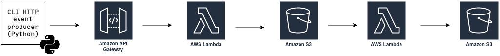

# AWS simple push pipeline example

## Architecture diagram


## Description
This repo contains an example of simple data pipeline built on top of **AWS** cloud.
It's an emulation of streaming pipeline (push type). Streaming is emulated with a Python CLI producer script.

Shape of event (JSON):
```
{
    id: string (uuid),
    sensor_id: string (uuid),
    temperature: number (float),
    epoch: number (integer)
}
```

Event is sent through HTTP POST method to Amazon API Gateway endpoint.
API Gateway endpoint is integrated with Lambda function which takes care of simple data transformation and loading transformed JSON file to S3 bucket.

## Repository structure
* `config.py` - place for configuration
* `models.py` - file containing definition of temperature measurement model
* `start_producer.py` - script containing code for spinning up event producers

Linting/code formatting configuration (I use `pre-commit` for pre-commit pipeline & `black` for autoformatting code & `flake8` for code linting) live in `.pre-commit-config.yaml` and `setup.cfg`.
## Configuration
Pipeline requires 2 environment variables:
* `API_URL` - url for API Gateway endpoint that implements `POST` method (Lambda function for data ingestion)
* `API_KEY` - api key (if you've decided to protect your API with api key)

I use `.env` file (located at the root of the repo) to keep these secrets safe (see `.env.example` for an example of such file).

## Starting consumer
Data producer is coded in Python 3. It has simple requirements (`requests` and `colorama`) listed in `requirements.txt`.

**Warning**<br>
Running below script may lead to generating costs on your AWS account. Be sure to know what you're doing ;-).

To start producer:
* project users `Docker` & `docker-compose`. Make sure you have them installed on your computer.
* build with `docker-compose build`
* run producer with `docker-compose run producer python start_producer.py -n-events 50 -n-workers 5 -max-delay 2`

Producer script accepts following input parameters:
* `-n-events` - amount of events that will be produced
* `-n-workers` - amount of concurrent workers (threads) that will be producing events
* `-max-delay` - time interval (in seconds) that worker sleeps for before producing new event (picked randomly from range 1 to `-max-delay` value)

To stop producer:
* press CTRL + C / CTRL + Break (some keyboard call it pause) multiple times (should be quicker)
* or use `docker-compose down`
