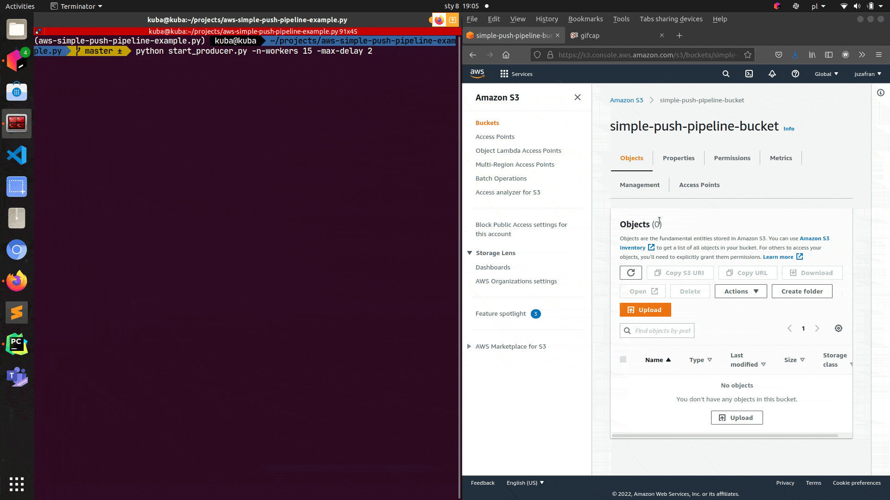

# AWS simple push pipeline example

## Architecture diagram


## Description
This repo contains an example of simple data pipeline built on top of **AWS** cloud.
It's an emulation of streaming pipeline (push type). Streaming is emulated with a Python CLI producer script.

Shape of event (JSON):
```
{
    id: string (uuid),
    sensor_id: string (uuid),
    temperature: number (float),
    epoch: number (integer)
}
```

Event is sent through HTTP POST method to Amazon API Gateway endpoint.
API Gateway endpoint is integrated with Lambda function which takes care of simple data transformation and loading transformed JSON file to S3 bucket.

## Configuration
Pipeline requires 2 environment variables:
* `API_URL` - url for API Gateway endpoint that implements `POST` method (Lambda function for data ingestion)
* `API_KEY` - api key (if you've decided to protect your API with api key)

I use `.env` file (located at the root of the repo) to keep these secrets safe (see `.env.example` for an example of such file).

## Starting consumer
Data producer is coded in Python 3. It has simple requirements (`requests` and `colorama`) listed in `requirements.txt`.

**Warning**<br>
Running below script may lead to generating costs on your AWS account. Be sure to know what you're doing ;-).

To start producer:
* make sure all dependencies from `requirements.txt` are installed (i.e. use virtual environment and activate it)
* run `python start_producer.py -n-workers 1 -max-delay 5`

To stop producer:
* Linux: press CTRL + C multiple times
* Windows: press CTRL + Break (some keyboard call it pause)

Above will be most probably replaced with shell scripts when project will be dockerized.

## Demo

